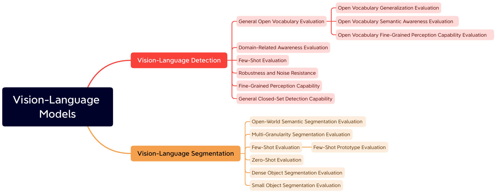

# Vision-Language Model Evaluation for Dense Prediction Vision Tasks: A Survey 

This is the repository of **Vision-Language Model Evaluation for Dense Prediction Vision Tasks: A Survey**

## Models

Last update on 2024/09/18

#### VLM Detection Models

* [CVPR 2022] Grounded Language-Image Pre-training [[Paper](https://arxiv.org/abs/2112.03857)][[Code](https://github.com/microsoft/GLIP)]
* [CVPR 2022] RegionCLIP: Region-based Language-Image Pretraining [[Paper](https://arxiv.org/abs/2112.09106)][[Code](https://github.com/microsoft/RegionCLIP)]
* [ECCV 2022] Open Vocabulary Object Detection with Pseudo Bounding-Box Labels [[Paper](https://arxiv.org/abs/2111.09452)][[Code](https://github.com/salesforce/PB-OVD)]
* [NeulIPS 2022] DetCLIP: Dictionary-Enriched Visual-Concept Paralleled Pre-training for Open-world Detection [[Paper](https://arxiv.org/abs/2209.09407)]
* [ECCV 2022] Simple Open-Vocabulary Object Detection with Vision Transformers [[Paper](https://arxiv.org/abs/2205.06230)][[Code](https://github.com/google-research/scenic/tree/main/scenic/projects/owl_vit)] 
* [NeurIPS 2023] Scaling Open-Vocabulary Object Detection [[Paper](https://arxiv.org/abs/2306.09683)][[Code](https://github.com/google-research/scenic/tree/main/scenic/projects/owl_vit)] 
* [CVPR 2023] DetCLIPv2: Scalable Open-Vocabulary Object Detection Pre-training via Word-Region Alignment [[Paper](https://arxiv.org/abs/2304.04514)]
* [CVPR 2024] DetCLIPv3: Towards Versatile Generative Open-vocabulary Object Detection [[Paper](https://arxiv.org/abs/2404.09216)]
* [ECCV 2024] Grounding DINO: Marrying DINO with Grounded Pre-Training for Open-Set Object Detection [[Paper](https://arxiv.org/abs/2303.05499)][[Code](https://github.com/IDEA-Research/GroundingDINO)]
* [CVPR 2024] YOLO-World: Real-Time Open-Vocabulary Object Detection [[Paper](https://arxiv.org/abs/2401.17270)][[Code](https://github.com/AILab-CVC/YOLO-World)]

#### VLM Segmentation Models

- [ICLR 2022] Language-driven Semantic Segmentation [[Paper]](https://arxiv.org/abs/2201.03546)[[code]](https://github.com/isl-org/lang-seg)
- [CVPR 2024] CAT-Seg: Cost Aggregation for Open-Vocabulary Semantic Segmentation [[Paper]](https://arxiv.org/abs/2303.11797)[[code]](https://github.com/KU-CVLAB/CAT-Seg)
- [CVPR 2023] Side Adapter Network for Open-Vocabulary Semantic Segmentation [[Paper]](https://arxiv.org/abs/2302.12242)[code](https://github.com/MendelXu/SAN)
- [ECCV 2022] A Simple Baseline for Open-Vocabulary Semantic Segmentation with Pre-trained Vision-language Model [[Paper]](https://arxiv.org/abs/2112.14757) [[code]](https://github.com/MendelXu/zsseg.baseline)
- [ICML 2023] Open-Vocabulary Universal Image Segmentation with MaskCLIP[[Paper]](https://arxiv.org/abs/2208.08984v2)[[code]](https://github.com/mlpc-ucsd/MaskCLIP)
- [ICCV 2023] Open-Vocabulary Semantic Segmentation with Decoupled One-Pass Network[[Paper]](https://arxiv.org/abs/2304.01198)[[code]](https://github.com/CongHan0808/DeOP)
- [NeurIPS 2023] Convolutions Die Hard: Open-Vocabulary Segmentation with Single Frozen Convolutional CLIP[[Paper]](https://arxiv.org/abs/2308.02487) [[code]](https://github.com/bytedance/fc-clip)
- [NeurIPS 2023] Learning Mask-aware CLIP Representations for Zero-Shot Segmentation [[Paper]](https://arxiv.org/abs/2310.00240) [[code]](https://github.com/jiaosiyu1999/MAFT)
- [CVPR 2024] SED: A Simple Encoder-Decoder for Open-Vocabulary Semantic Segmentation[[Paper]](https://arxiv.org/pdf/2311.15537v2)[[code]](https://github.com/xb534/SED)
- [CVPR 2024] Open-Vocabulary Segmentation with Semantic-Assisted Calibration[[Paper]](https://arxiv.org/abs/2312.04089)[[code]](https://github.com/yongliu20/SCAN)
- [CVPR 2024] Transferable and Principled Efficiency for Open-Vocabulary Segmentation[[Paper]](https://arxiv.org/abs/2404.07448) [[code]](https://github.com/Xujxyang/OpenTrans)
- [CVPR 2024] Open-Vocabulary Semantic Segmentation with Image Embedding Balancing[[Paper]](https://arxiv.org/abs/2406.09829)[[code]](https://github.com/slonetime/EBSeg)
- [CVPR 2022] Decoupling Zero-Shot Semantic Segmentation[[Paper]](https://arxiv.org/abs/2112.07910)[[code]](https://github.com/dingjiansw101/ZegFormer)
- [CVPR 2023] ZegCLIP: Towards Adapting CLIP for Zero-shot Semantic Segmentation[[Paper]](https://arxiv.org/abs/2212.03588) [[code]](https://github.com/ZiqinZhou66/ZegCLIP)
- [CVPR 2023] Primitive Generation and Semantic-related Alignment for Universal Zero-Shot Segmentation[[Paper]](https://arxiv.org/abs/2306.11087) [[code]](https://github.com/heshuting555/PADing)
- [ICML 2024] Cascade-CLIP: Cascaded Vision-Language Embeddings Alignment for Zero-Shot Semantic Segmentation[[Paper]](https://arxiv.org/abs/2406.00670) [[code]](https://github.com/HVision-NKU/Cascade-CLIP)
- [ICML2024] SegCLIP: Patch Aggregation with Learnable Centers for Open-Vocabulary Semantic Segmentation[[Paper]](https://arxiv.org/abs/2211.14813) [[code]](https://github.com/ArrowLuo/SegCLIP)
- [CVPR 2023] Learning to Generate Text-grounded Mask for Open-world Semantic Segmentation from Only Image-Text Pairs[[Paper]](https://arxiv.org/abs/2212.00785) [[code]](https://github.com/kakaobrain/tcl)

## Datasets

### Datasets for Detection

| Dataset                                             |  Year  | Classes | Training | Testing |Evaluation Metric| Project|
|-----------------------------------------------------|:------:|:-------:|:--------:|:-------:|:------:|:-----------:|
|COCO 2014 Detection|2014|80|83,000|41,000|Box mAP|[Project](https://www.kaggle.com/datasets/jeffaudi/coco-2014-dataset-for-yolov3)|
|COCO 2017 Detection|2017|80|118,000|5,000|Box mAP|[Project](https://www.kaggle.com/datasets/awsaf49/coco-2017-dataset)|
|LVIS|2019|1203|118,000|5,000|Box mAP|[Project](https://www.lvisdataset.org/)|
|ODinW|2022|314|132,413|20,070|Box mAP|[Project](https://eval.ai/web/challenges/challenge-page/1839/overview)|

### Datasets for Segmentation

| Dataset         | Year | Classes | Training | Testing | Evaluation Metric |                           Project                            |
| :-------------- | :--- | :-----: | :------: | :-----: | :---------------: | :----------------------------------------------------------: |
| COCO-Stuff      | 2018 |   172   |   118k   |   20k   |       mIoU        |      [Project](https://github.com/nightrome/cocostuff)       |
| PASCAL VOC 2012 | 2012 |   20    |  1,464   |  1,449  |       mIoU        |  [Project](http://host.robots.ox.ac.uk/pascal/VOC/voc2012/)  |
| PASCAL Content  | 2014 |   459   |  4,998   |  5,105  |       mIoU        | [Project](https://www.cs.stanford.edu/~roozbeh/pascal-context/) |
| Cityscapes      | 2016 |   19    |  2,975   |   500   |       mIoU        |        [Project](https://www.cityscapes-dataset.com/)        |
| ADE20k          | 2017 |   150   |  25,574  |  2,000  |       mIoU        | [Project](https://groups.csail.mit.edu/vision/datasets/ADE20K/) |
| MESS*           | 2023 |    -    |    -     |    -    |       mIoU        |        [Project](https://github.com/blumenstiel/MESS)        |
| PASCAL-Part     |      |         |          |         |                   |                                                              |
| ADE20k-Part-234 |      |         |          |         |                   |                                                              |
| PASCAL-5i       |      |         |          |         |                   |                                                              |
| COCO-20i        |      |         |          |         |                   |                                                              |
| FSS-100         |      |         |          |         |                   |                                                              |
| OCHuman         | 2019 |    1    |    -     |  2231   |  AP, AP50, AP75   |   [Project](https://github.com/liruilong940607/OCHumanApi)   |
| CIS             | 2023 |    1    |    -     |   459   |  AP, AP50, AP75   |       [Project](https://github.com/shanghangjiang/CIS)       |
| COCO-OCC        | 2021 |   80    |    -     |  1005   |  AP, AP50, AP75   |          [Project](https://github.com/lkeab/BCNet)           |
| CamVid          | 2008 |   11    |   467    |   233   |       mIoU        | [Project](https://mi.eng.cam.ac.uk/research/projects/VideoRec/CamVid/) |
| UAVid           | 2018 |    9    |   200    |   100   |       mIoU        |                [Projects](https://uavid.nl/)                 |
| UDD6            | 2018 |   12    |   205    |   45    |       mIoU        |          [Project](https://github.com/MarcWong/UDD)          |

*The benchmark includes a wide range of domain-specific datasets.