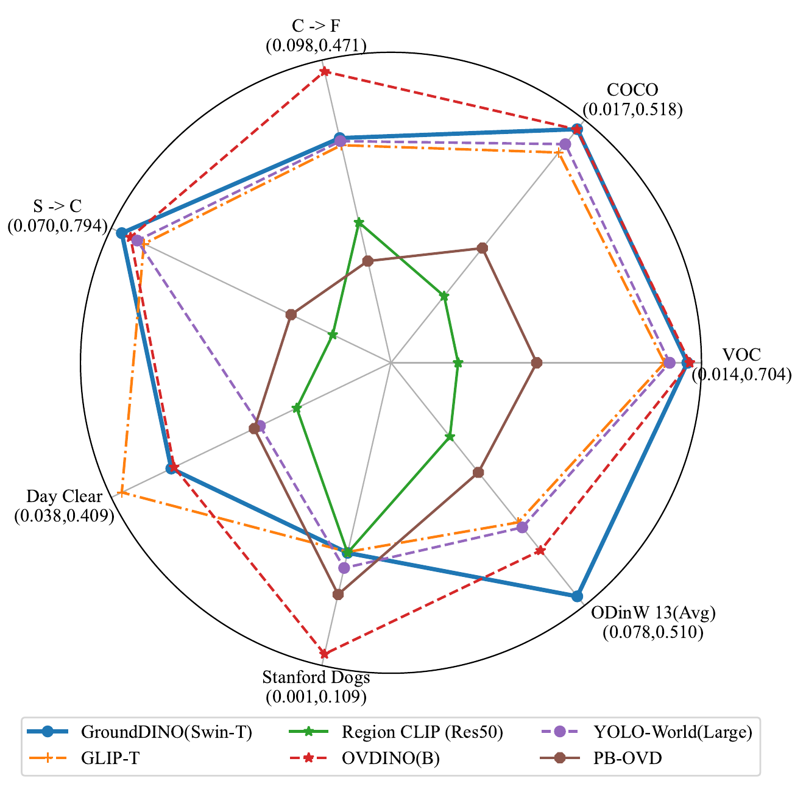
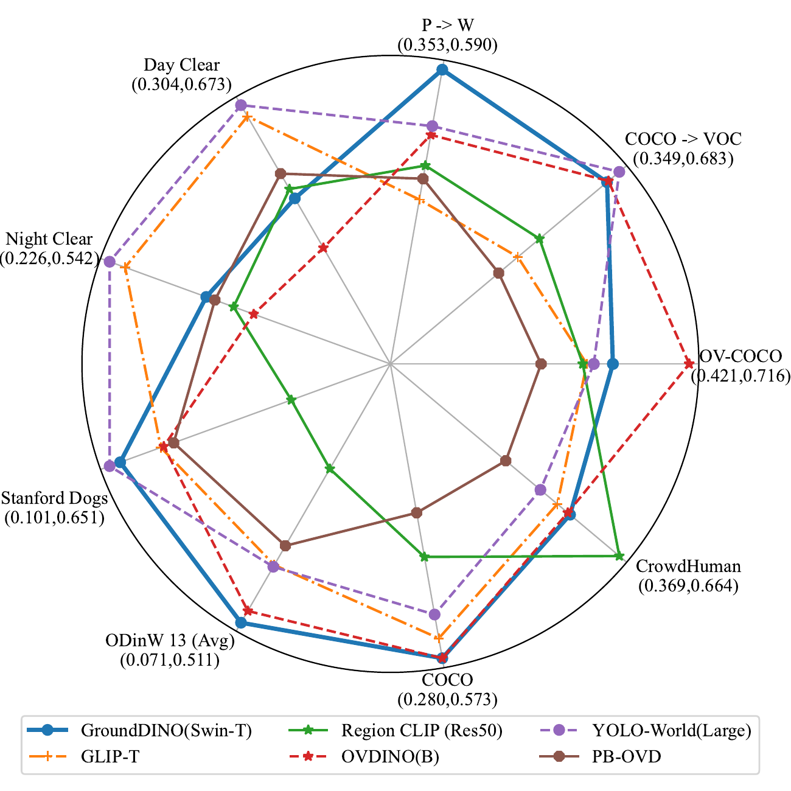
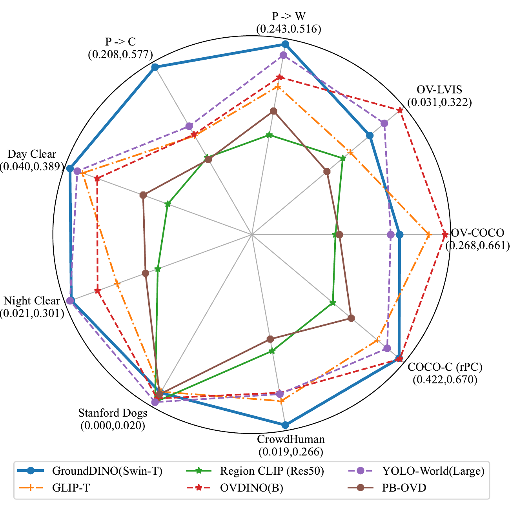
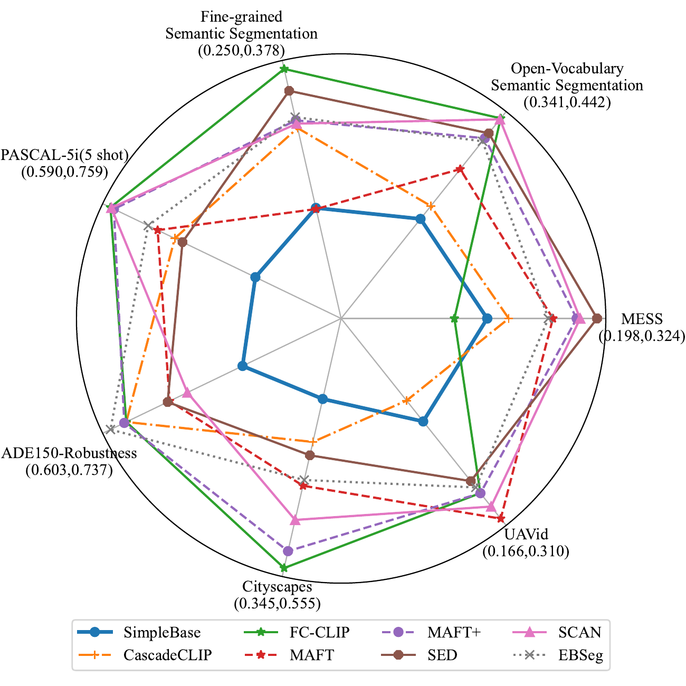

# Vision-Language Model for Object Detection and Segmentation: A Review and Evaluation 

This is the repository of **Vision-Language Model for Object Detection and Segmentation: A Review and Evaluation**

**Evaluation Radar Results**:

  
  

  
  

## Models

Last update on 2025/04/09

#### VLM Detection Models

**First Type**

* [CVPR 2022] Grounded Language-Image Pre-training [[Paper](https://arxiv.org/abs/2112.03857)][[Code](https://github.com/microsoft/GLIP)]
* [CVPR 2022] RegionCLIP: Region-based Language-Image Pretraining [[Paper](https://arxiv.org/abs/2112.09106)][[Code](https://github.com/microsoft/RegionCLIP)]
* [ECCV 2022] Open Vocabulary Object Detection with Pseudo Bounding-Box Labels [[Paper](https://arxiv.org/abs/2111.09452)][[Code](https://github.com/salesforce/PB-OVD)]
* [NeulIPS 2022] DetCLIP: Dictionary-Enriched Visual-Concept Paralleled Pre-training for Open-world Detection [[Paper](https://arxiv.org/abs/2209.09407)]
* [ECCV 2022] Simple Open-Vocabulary Object Detection with Vision Transformers [[Paper](https://arxiv.org/abs/2205.06230)][[Code](https://github.com/google-research/scenic/tree/main/scenic/projects/owl_vit)] 
* [NeurIPS 2023] Scaling Open-Vocabulary Object Detection [[Paper](https://arxiv.org/abs/2306.09683)][[Code](https://github.com/google-research/scenic/tree/main/scenic/projects/owl_vit)] 
* [CVPR 2023] DetCLIPv2: Scalable Open-Vocabulary Object Detection Pre-training via Word-Region Alignment [[Paper](https://arxiv.org/abs/2304.04514)]
* [CVPR 2024] DetCLIPv3: Towards Versatile Generative Open-vocabulary Object Detection [[Paper](https://arxiv.org/abs/2404.09216)]
* [ECCV 2024] Grounding DINO: Marrying DINO with Grounded Pre-Training for Open-Set Object Detection [[Paper](https://arxiv.org/abs/2303.05499)][[Code](https://github.com/IDEA-Research/GroundingDINO)]
* [CVPR 2024] YOLO-World: Real-Time Open-Vocabulary Object Detection [[Paper](https://arxiv.org/abs/2401.17270)][[Code](https://github.com/AILab-CVC/YOLO-World)]
* [arxiv] OV-DINO: Unified Open-Vocabulary Detection with Language-Aware Selective Fusion [[Paper](https://arxiv.org/abs/2407.07844)][[Code](https://github.com/wanghao9610/OV-DINO)]

**Second Type**

* [ECCV 2022] Detecting Twenty-thousand Classes using Image-level Supervision [[Paper](https://arxiv.org/abs/2201.02605)][[Code](https://github.com/facebookresearch/Detic)]

* [ICLR 2023] Learning Object-Language Alignments for Open-Vocabulary Object Detection [[Paper](https://arxiv.org/abs/2211.14843)][[Code](https://github.com/clin1223/VLDet)]

* [CVPR 2022] Learning to Prompt for Open-Vocabulary Object Detection with Vision-Language Model [[Paper](https://arxiv.org/abs/2203.14940)][[Code](https://github.com/dyabel/detpro)]
* [ECCV 2022] Open-Vocabulary DETR with Conditional Matching [[Paper](https://arxiv.org/abs/2203.11876)][[Code](https://github.com/yuhangzang/OV-DETR)]

* [ICLR 2022] Open-vocabulary Object Detection via Vision and Language Knowledge Distillation [[Paper](https://arxiv.org/abs/2104.13921)][[Code](https://github.com/tensorflow/tpu/tree/master/models/official/detection/projects/vild)]

* [CVPR 2022] Open-Vocabulary One-Stage Detection with Hierarchical Visual-Language Knowledge Distillation [[Paper](https://arxiv.org/abs/2203.10593)][[Code](https://github.com/mengqiDyangge/HierKD)]

* [ECCV 2022] PromptDet: Towards Open-vocabulary Detection using Uncurated Images [[Paper](https://arxiv.org/abs/2203.16513)][[Code](https://github.com/fcjian/PromptDet)]

* [CVPR 2023] Aligning Bag of Regions for Open-Vocabulary Object Detection [[Paper](https://arxiv.org/abs/2302.13996)][[Code](https://github.com/wusize/ovdet)]

* [NeurIPS 2023] CoDet: Co-Occurrence Guided Region-Word Alignment for Open-Vocabulary Object Detection [[Paper](https://arxiv.org/abs/2310.16667)][[Code](https://github.com/CVMI-Lab/CoDet)]

* [CVPR 2023] CORA: Adapting CLIP for Open-Vocabulary Detection with Region Prompting and Anchor Pre-Matching [[Paper](https://arxiv.org/abs/2303.13076)][[Code](https://github.com/tgxs002/CORA)]

* [ICCV 2023]  Distilling DETR with Visual-Linguistic Knowledge for Open-Vocabulary Object Detection [[Paper](https://openaccess.thecvf.com/content/ICCV2023/papers/Li_Distilling_DETR_with_Visual-Linguistic_Knowledge_for_Open-Vocabulary_Object_Detection_ICCV_2023_paper.pdf)][[Code](https://github.com/hikvision-research/opera/tree/main/configs/dk-detr)]

* [arxiv] DST-Det: Simple Dynamic Self-Training for Open-Vocabulary Object Detection[[Paper](https://arxiv.org/abs/2310.01393)][[Code](https://github.com/xushilin1/dst-det)]

* [ICCV 2023] EdaDet: Open-Vocabulary Object Detection Using Early Dense Alignment [[Paper](https://arxiv.org/abs/2309.01151)]

* [ICLR 2023] F-VLM: Open-Vocabulary Object Detection upon Frozen Vision and Language Models [[Paper](https://arxiv.org/abs/2209.15639)][[Code](https://github.com/google-research/google-research/tree/master/fvlm)]

* [ICML 2023] Multi-Modal Classifiers for Open-Vocabulary Object Detection [[Paper](https://arxiv.org/abs/2306.05493)][[Code](https://github.com/prannaykaul/mm-ovod)]

* [CVPR 2023] Object-Aware Distillation Pyramid for Open-Vocabulary Object Detection [[Paper](https://arxiv.org/abs/2303.05892)][[Code](https://github.com/LutingWang/OADP)]

* [arxiv] Prompt-Guided Transformers for End-to-End Open-Vocabulary Object Detection [[Paper](https://arxiv.org/abs/2303.14386)]

* [CVPR 2023] Region-Aware Pretraining for Open-Vocabulary Object Detection with Vision Transformers [[Paper](https://arxiv.org/abs/2305.07011)][[Code](https://github.com/google-research/google-research/tree/master/fvlm/rovit)]

* [CVPR 2024] Taming Self-Training for Open-Vocabulary Object Detection [[Paper](https://arxiv.org/abs/2308.06412)][[Code](https://github.com/xiaofeng94/SAS-Det)]

* [ICLR 2024] CLIPSelf: Vision Transformer Distills Itself for Open-Vocabulary Dense Prediction [[Paper](https://arxiv.org/abs/2310.01403)][[Code](https://github.com/wusize/CLIPSelf)]

* [WACV 2024] LP-OVOD: Open-Vocabulary Object Detection by Linear Probing [[Paper](https://arxiv.org/abs/2310.17109)][[Code](https://github.com/VinAIResearch/LP-OVOD)]

#### VLM Segmentation Models

- [ICLR 2022] Language-driven Semantic Segmentation [[Paper]](https://arxiv.org/abs/2201.03546)[[code]](https://github.com/isl-org/lang-seg)
- [CVPR 2024] CAT-Seg: Cost Aggregation for Open-Vocabulary Semantic Segmentation [[Paper]](https://arxiv.org/abs/2303.11797)[[code]](https://github.com/KU-CVLAB/CAT-Seg)
- [CVPR 2023] Side Adapter Network for Open-Vocabulary Semantic Segmentation [[Paper]](https://arxiv.org/abs/2302.12242)[code](https://github.com/MendelXu/SAN)
- [ECCV 2022] A Simple Baseline for Open-Vocabulary Semantic Segmentation with Pre-trained Vision-language Model [[Paper]](https://arxiv.org/abs/2112.14757) [[code]](https://github.com/MendelXu/zsseg.baseline)
- [ICML 2023] Open-Vocabulary Universal Image Segmentation with MaskCLIP[[Paper]](https://arxiv.org/abs/2208.08984v2)[[code]](https://github.com/mlpc-ucsd/MaskCLIP)
- [ICCV 2023] Open-Vocabulary Semantic Segmentation with Decoupled One-Pass Network[[Paper]](https://arxiv.org/abs/2304.01198)[[code]](https://github.com/CongHan0808/DeOP)
- [NeurIPS 2023] Convolutions Die Hard: Open-Vocabulary Segmentation with Single Frozen Convolutional CLIP[[Paper]](https://arxiv.org/abs/2308.02487) [[code]](https://github.com/bytedance/fc-clip)
- [NeurIPS 2023] Learning Mask-aware CLIP Representations for Zero-Shot Segmentation [[Paper]](https://arxiv.org/abs/2310.00240) [[code]](https://github.com/jiaosiyu1999/MAFT)
- [CVPR 2024] SED: A Simple Encoder-Decoder for Open-Vocabulary Semantic Segmentation[[Paper]](https://arxiv.org/pdf/2311.15537v2)[[code]](https://github.com/xb534/SED)
- [CVPR 2024] Open-Vocabulary Segmentation with Semantic-Assisted Calibration[[Paper]](https://arxiv.org/abs/2312.04089)[[code]](https://github.com/yongliu20/SCAN)
- [CVPR 2024] Transferable and Principled Efficiency for Open-Vocabulary Segmentation[[Paper]](https://arxiv.org/abs/2404.07448) [[code]](https://github.com/Xujxyang/OpenTrans)
- [CVPR 2024] Open-Vocabulary Semantic Segmentation with Image Embedding Balancing[[Paper]](https://arxiv.org/abs/2406.09829)[[code]](https://github.com/slonetime/EBSeg)
- [CVPR 2022] Decoupling Zero-Shot Semantic Segmentation[[Paper]](https://arxiv.org/abs/2112.07910)[[code]](https://github.com/dingjiansw101/ZegFormer)
- [CVPR 2023] ZegCLIP: Towards Adapting CLIP for Zero-shot Semantic Segmentation[[Paper]](https://arxiv.org/abs/2212.03588) [[code]](https://github.com/ZiqinZhou66/ZegCLIP)
- [CVPR 2023] Primitive Generation and Semantic-related Alignment for Universal Zero-Shot Segmentation[[Paper]](https://arxiv.org/abs/2306.11087) [[code]](https://github.com/heshuting555/PADing)
- [ICML 2024] Cascade-CLIP: Cascaded Vision-Language Embeddings Alignment for Zero-Shot Semantic Segmentation[[Paper]](https://arxiv.org/abs/2406.00670) [[code]](https://github.com/HVision-NKU/Cascade-CLIP)
- [ICML2024] SegCLIP: Patch Aggregation with Learnable Centers for Open-Vocabulary Semantic Segmentation[[Paper]](https://arxiv.org/abs/2211.14813) [[code]](https://github.com/ArrowLuo/SegCLIP)
- [CVPR 2023] Learning to Generate Text-grounded Mask for Open-world Semantic Segmentation from Only Image-Text Pairs[[Paper]](https://arxiv.org/abs/2212.00785) [[code]](https://github.com/kakaobrain/tcl)

## Datasets

### Datasets for Detection

| Dataset                                             |  Year  | Classes | Training | Testing |Evaluation Metric| Project|
|-----------------------------------------------------|:------:|:-------:|:--------:|:-------:|:------:|:-----------:|
|COCO 2014 Detection|2014|80|83,000|41,000|Box mAP|[Project](https://www.kaggle.com/datasets/jeffaudi/coco-2014-dataset-for-yolov3)|
|COCO 2017 Detection|2017|80|118,287|5,000|Box mAP|[Project](https://www.kaggle.com/datasets/awsaf49/coco-2017-dataset)|
|PASCAL VOC|2012|20|5,717|5,823|Box mAP|[Project](http://host.robots.ox.ac.uk/pascal/VOC/voc2012/)|
|LVIS|2019|1203|100,170|19,809|Box mAP|[Project](https://www.lvisdataset.org/)|
|ODinW|2022|314|132,413|20,070|Box mAP|[Project](https://eval.ai/web/challenges/challenge-page/1839/overview)|
|Objects365|2019|365|600,000|38,000|Box mAP|[Project](https://www.objects365.org/)|
|Stanford Dogs|2011|120|12,000|8,580|Box mAP|[Project](http://vision.stanford.edu/aditya86/ImageNetDogs/)|
|CUB-200-2011|2011|200|5,994|5,794|Box mAP|[Project](https://www.vision.caltech.edu/datasets/cub_200_2011/)|
|Cityscapes|2016|8|2,975|500|Box mAP|[Project](https://www.cityscapes-dataset.com/)|
|Foggy Cityscapes|2018|8|2,975|500|Box mAP|[Project](https://people.ee.ethz.ch/~csakarid/SFSU_synthetic/)|
|WaterColor|2018|6|1,000|-|Box mAP|[Project](https://github.com/naoto0804/cross-domain-detection)|
|Comic|2018|6|1,000|-|Box mAP|[Project](https://github.com/naoto0804/cross-domain-detection)|
|KITTI|2012|1|7,481|-|Box mAP|[Project](https://www.cvlibs.net/datasets/kitti/)|
|Sim10K|2016|1|10,000|-|Box mAP|[Project](https://fcav.engin.umich.edu/projects/driving-in-the-matrix)|
|VOC-C|2019|20|543,115|553,185|Box mAP|[Project](https://github.com/bethgelab/robust-detection-benchmark)|
|COCO-C|2019|80|11,237,265|475,000|Box mAP|[Project](https://github.com/bethgelab/robust-detection-benchmark)|
|Cityscapes-C|2019|8|282,625|47,500|Box mAP|[Project](https://github.com/bethgelab/robust-detection-benchmark)|
|CrowdHuman|2018|1|15,000|4,370|Box mAP|[Project](https://www.crowdhuman.org/)|
|OCHuman|2019|1|-|2,500|Box mAP|[Project](https://github.com/liruilong940607/OCHumanApi)|
|WiderPerson|2019|1|7,891|1,000|Box mAP|[Project](http://www.cbsr.ia.ac.cn/users/sfzhang/WiderPerson/)|

### Datasets for Segmentation

| Dataset         | Year | Classes | Training | Testing |  Evaluation Metric  |                           Project                            |
| :-------------- | :--- | :-----: | :------: | :-----: | :-----------------: | :----------------------------------------------------------: |
| COCO-Stuff      | 2018 |   172   |   118k   |   20k   |        mIoU         |      [Project](https://github.com/nightrome/cocostuff)       |
| PASCAL VOC 2012 | 2012 |   20    |  1,464   |  1,449  |        mIoU         |  [Project](http://host.robots.ox.ac.uk/pascal/VOC/voc2012/)  |
| PASCAL Content  | 2014 |   459   |  4,998   |  5,105  |        mIoU         | [Project](https://www.cs.stanford.edu/~roozbeh/pascal-context/) |
| Cityscapes      | 2016 |   19    |  2,975   |   500   |        mIoU         |        [Project](https://www.cityscapes-dataset.com/)        |
| ADE20k          | 2017 |   150   |  25,574  |  2,000  |        mIoU         | [Project](https://groups.csail.mit.edu/vision/datasets/ADE20K/) |
| MESS*           | 2023 |    -    |    -     |    -    |        mIoU         |        [Project](https://github.com/blumenstiel/MESS)        |
| PASCAL-Part     | 2023 |   116   |   8432   |   851   |        mIoU         |     [Project](https://github.com/OpenRobotLab/OV_PARTS)      |
| ADE20k-Part-234 | 2023 |   234   |   7348   |  1017   |        mIoU         |     [Project](https://github.com/OpenRobotLab/OV_PARTS)      |
| PASCAL-5i**     | 2015 |   20    |    -     |    -    |    mIoU, FB-IoU     |  [Project](http://host.robots.ox.ac.uk/pascal/VOC/voc2012/)  |
| COCO-20i**      | 2014 |   80    |    -     |    -    |    mIoU, FB-IoU     |             [Project](https://cocodataset.org/)              |
| FSS-1000        | 2020 |  1000   |   5200   |  2400   | mIoU, FB-IoUFSS-100 |        [Project](https://github.com/HKUSTCV/FSS-1000)        |
| OCHuman         | 2019 |    1    |    -     |  2231   |   AP, AP50, AP75    |   [Project](https://github.com/liruilong940607/OCHumanApi)   |
| CIS             | 2023 |    1    |    -     |   459   |   AP, AP50, AP75    |       [Project](https://github.com/shanghangjiang/CIS)       |
| COCO-OCC        | 2021 |   80    |    -     |  1005   |   AP, AP50, AP75    |          [Project](https://github.com/lkeab/BCNet)           |
| CamVid          | 2008 |   11    |   467    |   233   |        mIoU         | [Project](https://mi.eng.cam.ac.uk/research/projects/VideoRec/CamVid/) |
| UAVid           | 2018 |    9    |   200    |   100   |        mIoU         |                [Projects](https://uavid.nl/)                 |
| UDD6            | 2018 |   12    |   205    |   45    |        mIoU         |          [Project](https://github.com/MarcWong/UDD)          |

*The benchmark includes a wide range of domain-specific datasets.

**The benchmark has different training and testing sets under various settings.