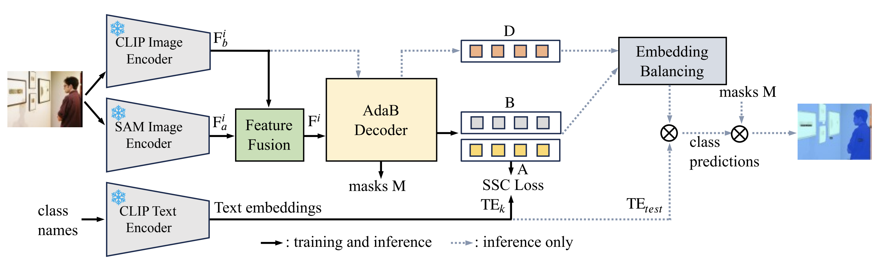

# Open-Vocabulary Semantic Segmentation with Image Embedding Balancing

[Open-Vocabulary Semantic Segmentation with Image Embedding Balancing](https://arxiv.org/abs/2311.15537)

<!-- [ALGORITHM] -->

## Abstract

EBSeg incorporating an Adaptively Balanced Decoder (AdaB Decoder) and a Semantic Structure Consistency loss (SSC Loss) to overcome overfitting to training classes. The
AdaB Decoder is designed to generate different image embeddings for both training and new classes. Subsequently,
these two types of embeddings are adaptively balanced to
fully exploit their ability to recognize training classes and
generalization ability for new classes. The SSC Loss aligns the inter-classes affinity in the image feature space with that in the text feature space of CLIP, thereby improving the generalization ability of EBSeg. Furthermore, a frozen SAM image encoder was used to complement the spatial information that CLIP features lack due to the low training image resolution and image-level supervision inherent in CLIP. 

 
## Installation
We install EBSeg using the official [github repository](https://github.com/slonetime/EBSeg) and follow the [instructions](https://github.com/slonetime/EBSeg/blob/main/README.md) to configure the environment.

