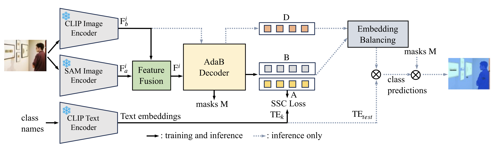

# Open-Vocabulary Semantic Segmentation with Image Embedding Balancing


[Open-Vocabulary Semantic Segmentation with Image Embedding Balancing](https://arxiv.org/abs/2311.15537)

<!-- [ALGORITHM] -->

## Abstract

EBSeg incorporating an Adaptively Balanced Decoder (AdaB Decoder) and a Semantic Structure Consistency loss (SSC Loss) to overcome overfitting to training classes. The
AdaB Decoder is designed to generate different image embeddings for both training and new classes. Subsequently,
these two types of embeddings are adaptively balanced to
fully exploit their ability to recognize training classes and
generalization ability for new classes. The SSC Loss aligns the inter-classes affinity in the image feature space with that in the text feature space of CLIP, thereby improving the generalization ability of EBSeg. Furthermore, a frozen SAM image encoder was used to complement the spatial information that CLIP features lack due to the low training image resolution and image-level supervision inherent in CLIP. 


 
## Installation
We install EBSeg using the official [github repository](https://github.com/slonetime/EBSeg) and follow the [instructions](https://github.com/slonetime/EBSeg/blob/main/README.md) to configure the environment.

### Environment setup

First, clone this repo:
``` bash
git clone https://github.com/slonetime/EBSeg.git
```
Then, create a new conda env and install required packeges:
``` bash
cd EBSeg
conda create --name ebseg python=3.9
conda activate ebseg
pip install -r requirements.txt
python -m pip install 'git+https://github.com/facebookresearch/detectron2.git'
```
At last, install the MultiScaleDeformableAttention in Mask2former:

``` bash
cd ebseg/model/mask2former/modeling/pixel_decoder/ops/
sh make.sh 
```

### Data preparation

We follow the dataset preparation process in SAN, so please follow the instructions in https://github.com/MendelXu/SAN?tab=readme-ov-file#data-preparation.


See [SimSeg](https://github.com/MendelXu/zsseg.baseline) for reference. The data should be organized like:
```
datasets/
    coco/
        ...
        train2017/
        val2017/
        stuffthingmaps_detectron2/
    VOC2012/
        ...
        images_detectron2/
        annotations_detectron2/
    pcontext/
        ...
        val/
    pcontext_full/
        ...
        val/
    ADEChallengeData2016/
        ...
        images/
        annotations_detectron2/
    ADE20K_2021_17_01/
        ...
        images/
        annotations_detectron2/        
```
**Hint** In the code, those datasets are registered with their related dataset names. The relationship is:
```
coco_2017_*_stuff_sem_seg : COCO Stuff-171
voc_sem_seg_*: Pascal VOC-20
pcontext_sem_seg_*: Pascal Context-59
ade20k_sem_seg_*: ADE-150
pcontext_full_sem_seg_*： Pascal Context-459
ade20k_full_sem_seg_*: ADE-847
```
<span id="3"></span>


## Training

First, change the config_file path, dataset_dir path and ourput_dir path in train.sh. Then, you can train an EBSeg model with the following command:
``` bash
bash train.sh
```

## Inference

Download our trained models from the url links in the followding table(with mIoU metric):

| Model | A-847 | PC-459| A-150| PC-59| VOC|
|---|---|---|---|---|---|
|[EBSeg-B](https://huggingface.co/slonetime/EBSeg/resolve/main/EBSeg_base.pth) | 11.1 | 17.3 | 30.0 | 56.7 | 94.6 |
|[EBSeg-L](https://huggingface.co/slonetime/EBSeg/resolve/main/EBSeg_large.pth)| 13.7 | 21.0 | 32.8 | 60.2 | 96.4 |


Like training, you should change the config_file path, dataset_dir path, checkpoint path and ourput_dir path in test.sh. Then, test a EBSeg model by:
``` bash
bash test.sh
```