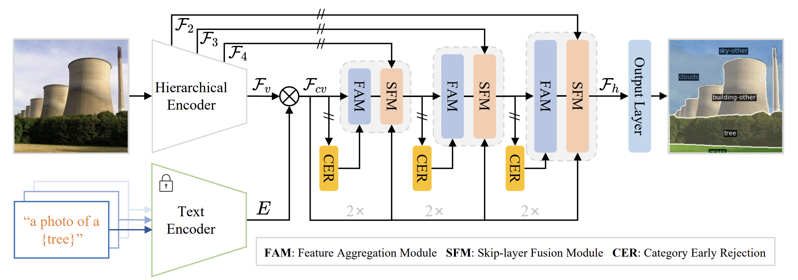

# Transferable and Principled Efficiency for Open-Vocabulary Segmentation

[Transferable and Principled Efficiency for Open-Vocabulary Segmentation](https://arxiv.org/abs/2404.07448)

<!-- [ALGORITHM] -->

## Abstract

<!-- Open-Vocabulary Segmentation approach often introduces heavy computational overheads for two challenges: 1) large model sizes of the backbone; 2) expensive costs during the fine-tuning. Traditional efficiency methods such as model compression and efficient fine-tuning can address these challenges, but their solutions cannot be easily transferred and necessitate re-training on different models.  -->
OpenTrans propose a transferable open-vocabulary segmentation technic, to establish a principled and seamlessly transferable efficiency across various OVS frameworks. First, to address the large model size of the CLIP image encoder, OpenTrans explore small subnetwork by iterative magnitude pruning. Second, to address the heavy OVS fine-tuning computation problem, OpenTrans proposes to select only some layers at the lighter tail of the pre-trained weight spectrum for updating.

 
## Installation
We install OpenTrans using the official [github repository](https://github.com/Xujxyang/OpenTrans) and follow the [instructions](https://github.com/bytedance/fc-clip/blob/main/INSTALL.md) to configure the environment.

