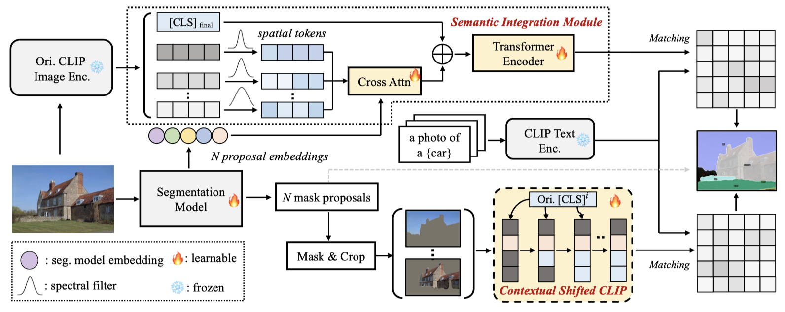

# Open-Vocabulary Segmentation with Semantic-Assisted Calibration


[Open-Vocabulary Segmentation with Semantic-Assisted Calibration](https://arxiv.org/abs/2312.04089)

<!-- [ALGORITHM] -->

## Abstract
SCAN is an open vocabulary semantic segmentation model. It believes that the gap between open vocabulary models and supervised methods lies in the in-vocabulary embedding and domain-biased CLIP prediction. Therefore, SCAN incorporate generalized semantic prior of CLIP into proposal embedding to avoid collapsing on known categories. Besides, a contextual shift strategy is applied to mitigate the
lack of global context and unnatural background noise.



 
## Installation
We install SCAN using the official [github repository](https://github.com/yongliu20/SCAN/tree/main) and follow the [instructions](https://github.com/yongliu20/SCAN/blob/main/INSTALL.md) to configure the environment.

### Prepare Datasets

Please follow the instruction of [ov-seg](https://github.com/facebookresearch/ov-seg) to prepare the training and test data. The data should be organized like:
```
$DETECTRON2_DATASETS/
  coco/                 # COCOStuff-171
  ADEChallengeData2016/ # ADE20K-150
  ADE20K_2021_17_01/    # ADE20K-847
  VOCdevkit/
    VOC2012/            # PASCALVOC-20
    VOC2010/            # PASCALContext-59, PASCALContext-459
```


<span id="3"></span>

### Usage

- #### Pretrained Weight
  We have provided the pretrained SCAN-VitL weights and the finetuned Contextual-shifted CLIP weights. Please download them from [here](https://drive.google.com/drive/folders/1obgHGQngtQms0u5YUJRnwd4y1IzME-c8?usp=drive_link).


#### Evaluation 

  <span id="4"></span>
  ```
  python train_net.py --eval-only --config-file <CONFIG_FILE> --num-gpus <NUM_GPU> OUTPUT_DIR <OUTPUT_PATH> MODEL.WEIGHTS <TRAINED_MODEL_PATH>
  ```
  - Here is an example:
  ```
  python train_net.py --num-gpu 8 --eval-only --config-file configs/scan_vitL.yaml MODEL.WEIGHTS ./SCAN.pth DATASETS.TEST \(\"ade20k_sem_seg_val\",\) MODEL.CLIP_ADAPTER.REPLACE_RATIO 0.05 MODEL.CLIP_ADAPTER.CLIP_ENSEMBLE_WEIGHT 0.75 MODEL.CLIP_ADAPTER.MASK_THR 0.55
  ```

<span id="5"></span>
#### Training
1. Train the segmentation model:
  ```
  python train_net.py  --config-file <CONFIG_FILE> --num-gpus <NUM_GPU>
  ```

  - Here is an example:

  ```
  python train_net.py  --num-gpu 8 --config-file configs/scan_vitL.yaml
  ```

2. Fuse segmentation model with finetuned CLIP.

  We have provided the [finetuned CLIP weights](https://drive.google.com/drive/folders/1obgHGQngtQms0u5YUJRnwd4y1IzME-c8?usp=drive_link). You can directly fuse the pretrained weights with the segmentation model to get the final model. The fuse command is:
  ```
  cd tools
  python replace_clip.py
  ```
  You need to specify the "clip_ckpt" and "ovseg_model" in the file according to your CLIP path and segmentation model path.


  (Optional) If you want to finetune the CLIP model from scratch, please follow  [ov-seg](https://github.com/facebookresearch/ov-seg) to prepare the corresponding data. The finetued command is:

  ```
  cd open_clip_training
  cd src
  bash scripts/finetune_VitL_with_mask.sh
  ```


<span id="6"></span>