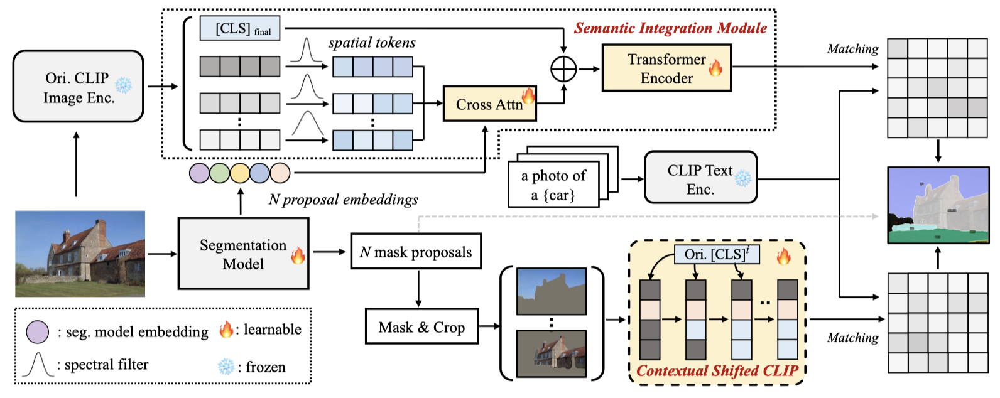

# Open-Vocabulary Segmentation with Semantic-Assisted Calibration

[Open-Vocabulary Segmentation with Semantic-Assisted Calibration](https://arxiv.org/abs/2312.04089)

<!-- [ALGORITHM] -->

## Abstract
SCAN is an open vocabulary semantic segmentation model. It believes that the gap between open vocabulary models and supervised methods lies in the in-vocabulary embedding and domain-biased CLIP prediction. Therefore, SCAN incorporate generalized semantic prior of CLIP into proposal embedding to avoid collapsing on known categories. Besides, a contextual shift strategy is applied to mitigate the
lack of global context and unnatural background noise.

 
## Installation
We install SCAN using the official [github repository](https://github.com/yongliu20/SCAN/tree/main) and follow the [instructions](https://github.com/yongliu20/SCAN/blob/main/INSTALL.md) to configure the environment.

