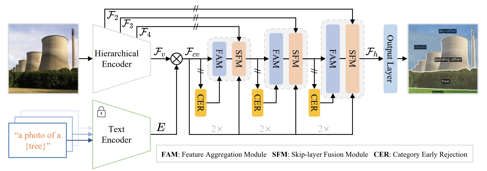

# SED: A Simple Encoder-Decoder for Open-Vocabulary Semantic Segmentation


[SED: A Simple Encoder-Decoder for Open-Vocabulary Semantic Segmentation](https://arxiv.org/abs/2311.15537)

<!-- [ALGORITHM] -->

## Abstract

SED is an open-vocabulary semantic segmentation model that features a hierarchical encoder-based cost map generation and a gradual fusion decoder with an early category rejection mechanism. Unlike plain transformers, the hierarchical backbone more effectively captures local spatial information and maintains linear computational complexity relative to input size. The early category rejection scheme in the decoder discards many non-existent categories in the early stages of decoding, significantly speeding up inference by up to 4.7 times without sacrificing accuracy.



 
## Installation
We install SED using the official [github repository](https://github.com/xb534/SED) and follow the [instructions](https://github.com/xb534/SED/blob/main/INSTALL.md) to configure the environment.

### Prepare Datasets

A dataset can be used by accessing [DatasetCatalog](https://detectron2.readthedocs.io/modules/data.html#detectron2.data.DatasetCatalog)
for its data, or [MetadataCatalog](https://detectron2.readthedocs.io/modules/data.html#detectron2.data.MetadataCatalog) for its metadata (class names, etc).
This document explains how to setup the builtin datasets so they can be used by the above APIs.
[Use Custom Datasets](https://detectron2.readthedocs.io/tutorials/datasets.html) gives a deeper dive on how to use `DatasetCatalog` and `MetadataCatalog`,
and how to add new datasets to them.

SED has builtin support for a few datasets.
The datasets are assumed to exist in a directory specified by the environment variable
`DETECTRON2_DATASETS`.
Under this directory, detectron2 will look for datasets in the structure described below, if needed.
```
$DETECTRON2_DATASETS/
  coco-stuff/             # COCO-Stuff
  ADEChallengeData2016/   # ADE20K-150
  ADE20K_2021_17_01/      # ADE20K-847
  VOCdevkit/ 
    VOC2010/              # PASCAL Context
    VOC2012/              # PASCAL VOC
```

You can set the location for builtin datasets by `export DETECTRON2_DATASETS=/path/to/datasets`.
If left unset, the default is `./datasets` relative to your current working directory.

### Requirements
- Linux or macOS with Python ≥ 3.8
- PyTorch ≥ 1.13 is recommended and [torchvision](https://github.com/pytorch/vision/) that matches the PyTorch installation.
  Install them together at [pytorch.org](https://pytorch.org) to make sure of this. Note, please check
  PyTorch version matches that is required by Detectron2.
- Detectron2: follow [Detectron2 installation instructions](https://detectron2.readthedocs.io/tutorials/install.html).
- OpenCV is optional but needed by demo and visualization
- `pip install -r requirements.txt`

An example of installation is shown below:

```
git clone https://github.com/xb534/SED.git
cd SED
conda create -n sed python=3.8
conda activate sed
conda install pytorch==1.13.1 torchvision==0.14.1 torchaudio==0.13.1 pytorch-cuda=11.7 -c pytorch -c nvidia
pip install -r requirements.txt
cd open_clip/
make install
```

## Training
We provide shell scripts for training and evaluation. ```run.sh``` trains the model in default configuration and evaluates the model after training. 

To train or evaluate the model in different environments, modify the given shell script and config files accordingly.

### Training script
```bash
sh run.sh [CONFIG] [NUM_GPUS] [OUTPUT_DIR] [OPTS]

# For ConvNeXt-B variant
sh run.sh configs/convnextB_768.yaml 4 output/
# For ConvNeXt-L variant
sh run.sh configs/convnextL_768.yaml 4 output/
```

## Evaluation
```eval.sh``` automatically evaluates the model following our evaluation protocol, with weights in the output directory if not specified.
To individually run the model in different datasets, please refer to the commands in ```eval.sh```.

### Evaluation script
```bash
sh run.sh [CONFIG] [NUM_GPUS] [OUTPUT_DIR] [OPTS]

sh eval.sh configs/convnextB_768.yaml 4 output/ MODEL.WEIGHTS path/to/weights.pth

# Fast version.
sh eval.sh configs/convnextB_768.yaml 4 output/ MODEL.WEIGHTS path/to/weights.pth  TEST.FAST_INFERENCE True  TEST.TOPK 8
```

