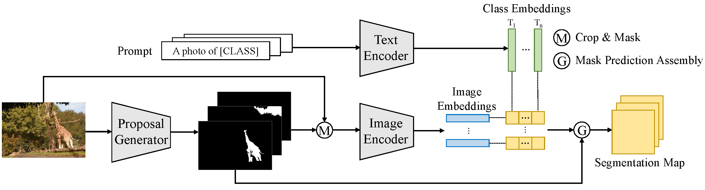

# A Simple Baseline for Open-Vocabulary Semantic Segmentation with Pre-trained Vision-language Model

[A Simple Baseline for Open-Vocabulary Semantic Segmentation with Pre-trained Vision-language Model](https://arxiv.org/abs/2112.14757)

## Abstract

This paper targets open-vocabulary semantic segmentation by building it on an off-the-shelf pre-trained vision-language model, i.e., CLIP. However, semantic segmentation and the CLIP model perform on different visual granularity, that semantic segmentation processes on pixels while CLIP performs on images. To remedy the discrepancy in processing granularity, we refuse the use of the prevalent one-stage FCN based framework, and advocate a two-stage semantic segmentation framework, with the first stage extracting generalizable mask proposals and the second stage leveraging an image based CLIP model to perform open-vocabulary classification on the masked image crops which are generated in the first stage.

<div align=center>
    
</div>

## Installation

```bash
# clone the official repo
git clone https://github.com/MendelXu/zsseg.baseline.git
cd zsseg.baseline

# install packages
# For detectron2, following https://detectron2.readthedocs.io/en/latest/tutorials/install.html to install it and some required packages
pip install torch==1.8.0 torchvision==0.9.0 detectron2==0.6 mmcv==1.3.14

# install the modified clip package
cd third_party/CLIP
python -m pip install -Ue .
```

## Zero-Shot Evaluation

### 1. Dataset Preparation

**Cross-datasets setting**

In the cross-datasets zero-shot setting, we use ADE20K-150, ADE20k-847, PAS-20, PAS-20g, PC-59 and PC-459 datasets.

For ADE20K-150, ADE20k-847, PC-59, please follow the tutorial in [zsseg.baseline](https://github.com/MendelXu/zsseg.baseline)

For PC-459, PAS-20g, PAS-20, please follow the tutorial in [CAT-Seg](https://github.com/KU-CVLAB/CAT-Seg)

Download the [register_pascal_20.py](./zero-shot-config/register_pascal_20.py) and [register_pcontext_459.py](./zero-shot-config/register_pcontext_459.py), and put them into `zsseg.baseline/mask_former/data/datasets`. 

Remember to add the following two lines of code in `zsseg.baseline/mask_former/data/datasets/__init__.py`

```python
from .register_pascal_20 import register_all_pascal_voc
from .register_pcontext_459 import register_pascal_context_459
```

### 2. Config Preparation

**Cross-datasets setting**

Download the config of [pas-20](./zero-shot-config/pas-20-config.yaml), [pas-20g](./zero-shot-config/pas-20g-config.yaml) and [pcontect-459-config](./zero-shot-config/pcontect-459-config.yaml)

### 3. Weights Preparation

**Cross-datasets setting**

Please download the checkpoints of [COCO-Stuff-156-trained-weight](https://drive.google.com/file/d/1pb6UeXoMPy5xdEBtFcQYLOBKZt0xufKY/view?usp=sharing) to the weights directory.

### 4. Evaluation

**Cross-datasets Evaluation script**

Replace the `train_net.py` file with this [file](./zero-shot-config/train_net.py).

```bash
# DATASET: the name of other datset, can be ade20k-150, ade20k-847, cityscapes-19, pcontext-59, pcontext-459, pas-20, pas-20g
python train_net.py --eval-only --resume --config-file configs/${DATASET}/cross_dataset_test_only.yaml --num-gpus [gpu_nums] MODEL.WEIGHTS ${TRAINED_MODEL_PATH}
```


