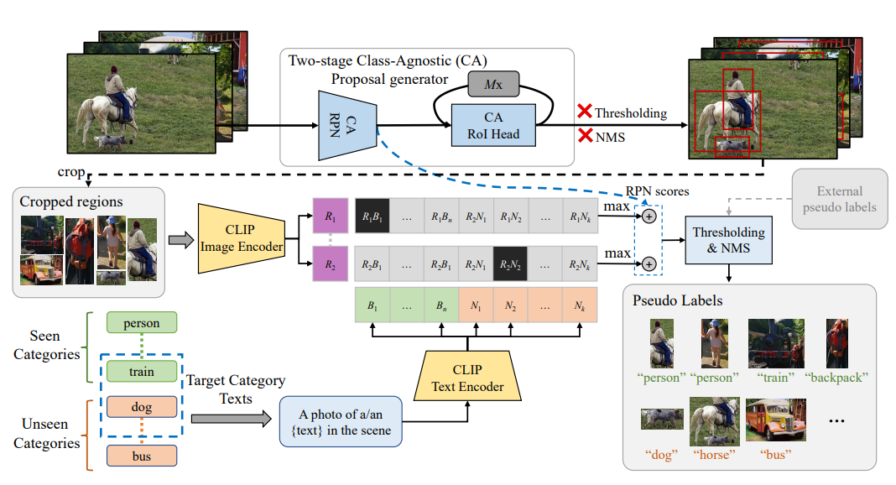

# Exploiting unlabeled data with vision and language models for object detection
Paper is this [URL](https://arxiv.org/abs/2207.08954).The official code is the [VL-PLM](https://github.com/xiaofeng94/VL-PLM).  
  
## Abstract
Building robust and generic object detection frameworks requires scaling to larger label spaces and bigger training datasets. However, it is prohibitively costly to acquire annotations for thousands of categories at a large scale. We propose a novel method that leverages the rich semantics available in recent vision and language models to localize and classify objects in unlabeled images, effectively generating pseudo labels for object detection. Starting with a generic and class-agnostic region proposal mechanism, we use vision and language models to categorize each region of an image into any object category that is required for downstream tasks. We demonstrate the value of the generated pseudo labels in two specific tasks, open-vocabulary detection, where a model needs to generalize to unseen object categories, and semi-supervised object detection, where additional unlabeled images can be used to improve the model. Our empirical evaluation shows the effectiveness of the pseudo labels in both tasks, where we outperform competitive baselines and achieve a novel state-of-the-art for open-vocabulary object detection.


## Installation
### Requirements
Install pytorch
```
conda install pytorch==1.10.1 torchvision==0.11.2 torchaudio=0.10.1 cudatoolkit=10.2 -c pytorch  
```  
Install the Detectron2 library.  
```
git clone https://github.com/facebookresearch/detectron2.git
python -m pip install -e detectron2
```    
Then:  
```
git clone https://github.com/xiaofeng94/VL-PLM  
```  
### Dataset Prepare
See [Data Preparation](https://github.com/xiaofeng94/VL-PLM).  
### Inference
python ./eval_coco_train_net.py
### Configs
See ./configs/eval_coco_2_XXX.yaml
You could change configs in ./eval_coco_train_net.py
Download the pretrained weights [here](https://drive.google.com/file/d/1bk0yrHdPe-gaO0goDDLmHY0KAOy7fR_y/view) .  
