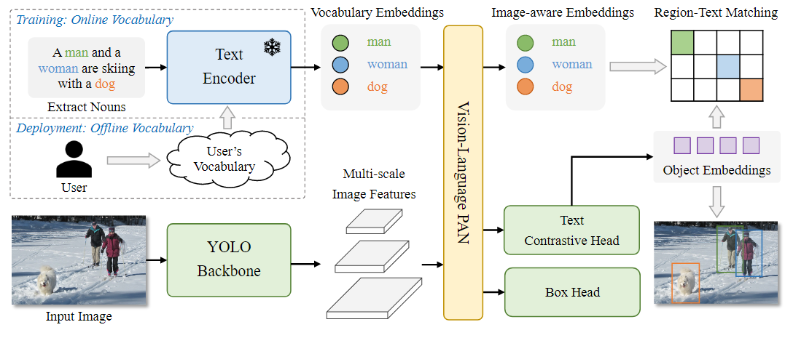

# YOLO-World: Real-Time Open-Vocabulary Object Detection

[YOLO-World: Real-Time Open-Vocabulary Object Detection](https://arxiv.org/pdf/2401.17270)

## Abstract

YOLO-World enhances YOLO with open vocabulary detection capabilities through vision-language modeling and pre-training on large-scale datasets. It utilizes a new Re-parameterizable VisionLanguage Path Aggregation Network (RepVL-PAN) and region-text contrastive loss to facilitate the interaction between visual and linguistic information.



## Installation

YOLO-World is developed based on `torch==1.11.0` `mmyolo==0.6.0` and `mmdetection==3.0.0`. 
You can refer to the [official](https://github.com/AILab-CVC/YOLO-World) installation process, or follow the process I tested: 

```shell
### --- Git Clone the project
git clone --recursive https://github.com/AILab-CVC/YOLO-World.git

### --- Create conda enviroment
conda create -n yolo_world python=3.9

### --- 
pip install openmim -i https://pypi.tuna.tsinghua.edu.cn/simple
mim install mmcv==2.0.0 
pip install /gpfsdata/home/huangziyue/TOOLS/torch-1.11.0+cu113-cp39-cp39-linux_x86_64.whl
pip install torchvision==0.12.0
pip install mmcv==2.0.0 -f https://download.openmmlab.com/mmcv/dist/cu113/torch1.11/index.html
pip install mmyolo==0.6.0
pip install mmdet==3.0.0
pip install -e . -i https://pypi.tuna.tsinghua.edu.cn/simple

### --- 
 ln -s /gpfsdata/home/huangziyue/data/coco ./data/coco
 
### --- 
./tools/dist_train.sh ./configs/finetune_coco/yolo_world_v2_s_vlpan_bn_2e-4_80e_8gpus_mask-refine_finetune_coco.py 4 --amp

```

## About YOLO-World
YOLO-World provides two fine-tuning strategies: Prompt Tuning and Full Fine-tuning. 

Prompt Tuning uses a learnable prompt and freezes the backbone to preserve zero-shot capability. 

Full Fine-tuning consists of two methods: Direct Fine-tuning, which retains the interaction between text embeddings and features, and Reparameterization Fine-tuning, which requires reparameterizing YOLO-World to obtain a detection model with the same structure as YOLO-v8 before fine-tuning.


## Visual Finetune 

We fine-tune the VLM using common detection datasets such as COCO and VOC to test its performance on closed-set detection tasks. In this setup, VLM is utilized as a well-pretrained detector for comparison with traditional detection models.


```shell
./tools/dist_train.sh ./configs/Gneral_Finetune_VOC_YOLOw_Large.py 4 --amp
```

## Text prompt

According to the introduction above, we modified the config file to implement the "text prompt".

```shell
./tools/dist_train.sh ./configs/Gneral_TextTune_VOC_YOLOw_Large.py 4 --amp
```
## Zero prediction

The same config file can be used for both "zero prediction" and "visual finetune".

```shell
./tools/dist_test.sh ./configs/Gneral_Finetune_VOC_YOLOw_Large.py path/to/weights 4 --amp
```

