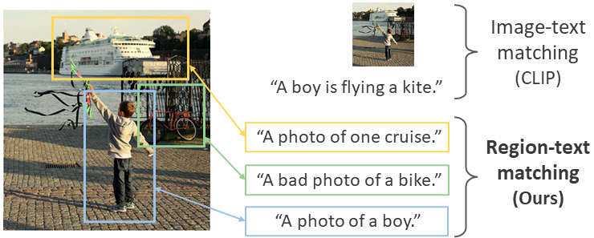

# RegionCLIP: Region-based Language-Image Pretraining

[RegionCLIP: Region-based Language-Image Pretraining](https://arxiv.org/abs/2112.09106)

<!-- [ALGORITHM] -->

## Abstract

RegionCLIP extends CLIP to learn region-level visual representations. RegionCLIP enables fine-grained alignment between image regions and textual concepts, and thus supports region-based reasoning tasks including zero-shot object detection and open-vocabulary object detection.

- **Pretraining**: We leverage a CLIP model to match image regions with template captions, and then pretrain our model to align these region-text pairs.
- **Zero-shot inference**: Once pretrained, the learned region representations support zero-shot inference for object detection.
- **Transfer learning**: The learned RegionCLIP model can be further fine-tuned with additional object detection annotations, allowing our model to be used for fully supervised or open-vocabulary object detection.
- **Results**: Our method demonstrates **state-of-the-art** results for zero-shot object detection and open-vocabulary object detection.

<div align=center>

</div>
 
## Installation
Here we use groundingdino's mmdetection implementation, clone the [repo](https://github.com/open-mmlab/mmdetection/tree/dev-3.x) and follow the [instructions](https://github.com/open-mmlab/mmdetection/blob/dev-3.x/configs/grounding_dino/README.md) to configure the environment.


## Domain-related Evaluation
Here we evaluate the performance of GroundingDino on cross-domain data, taking the [Diverse Weather](https://github.com/AmingWu/Single-DGOD) dataset as an example.
### 1. Dataset Preparation
Download [Diverse Weather](https://github.com/AmingWu/Single-DGOD) Datasets and convert the dataset into coco format. Diverse Weather consists of images from five different weather conditions in urban scenes: daytime sunny, night sunny, dusk rainy, night rainy, and daytime foggy. Examples from the five scenes are illustrated as following. Here, we view daytime sunny scene as source domain and test on the other four challenging weather conditions (unseen target domains).


### 2. Config Preparation

Here we consider two evaluation methods: 1. Zero prediction：Directly use the weights to evaluate on 5 scenarios; 2. Full finetune: Use the weights to perform full finetuning on the source domain, and then evaluate the performance on the unseen target domain.

The Details of the configuration can be found in [grounding_dino_swin-t_finetune_8xb2_20e_weather](grounding_dino_swin-t_finetune_8xb2_20e_weather.py), and we put this configuration file into ./configs/grounding_dino in [repo](https://github.com/open-mmlab/mmdetection/tree/dev-3.x).

### 3. Zero prediction

```shell
# $MMDETROOT represents the main directory of the [repo](https://github.com/open-mmlab/mmdetection/tree/dev-3.x).

cd $MMDETROOT

# download the pretrained weights
wget https://download.openmmlab.com/mmdetection/v3.0/grounding_dino/groundingdino_swint_ogc_mmdet-822d7e9d.pth

# perform the zero prediction
python tools/test.py configs/grounding_dino/grounding_dino_swin-t_finetune_8xb2_20e_weather.py groundingdino_swint_ogc_mmdet-822d7e9d.pth
```

### 4. Source Finetune and evaluation

```shell
# finetune on the source domain dataset, here, we use 4 cards to train 20 epochs, scale the learning rate accordingly, and do not train the language model, only the visual model.

./tools/dist_train.sh configs/grounding_dino/grounding_dino_swin-t_finetune_8xb2_20e_weather.py 4 --work-dir work_dir/weather_work_dir

```
The model will be saved based on the best performance on the test set.

```shell
# Then we test the best model on the different unseen target dataset. Here we assume that epoch_20.pth is the best model.

python tools/test.py configs/grounding_dino/grounding_dino_swin-t_finetune_8xb2_20e_weather.py work_dir/weather_work_dir/epoch_20.pth

```
